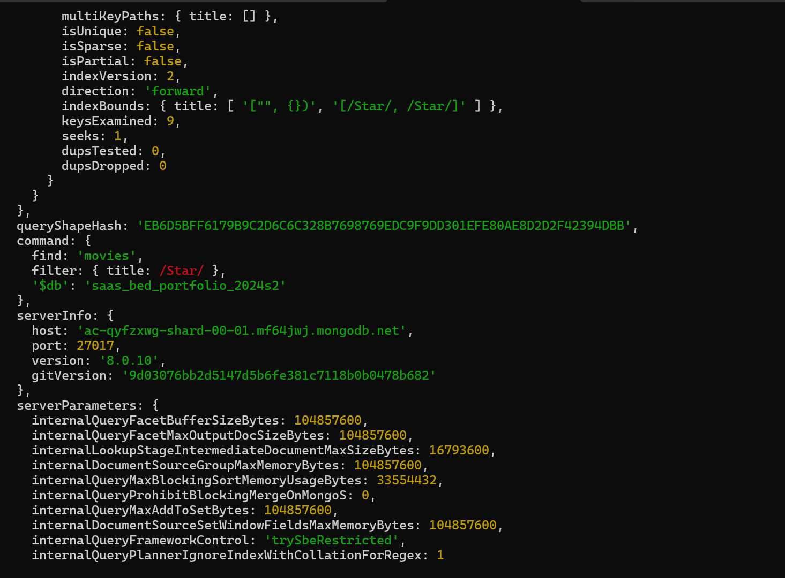

# Answers

## Software as a Service - Back-End Development

### Diploma of Information Technology (Advanced Programming)  

### Diploma of Information Technology (Back-End Development)

Complete this table with the required information, then remove this line:

| Given Name | Family Name | Student ID |
| ---------- | ----------- | ---------- |
| Tadiwanashe| Gukwa       | 20095319   |


---
```table-of-contents
title: # Contents
style: nestedList
minLevel: 0
maxLevel: 3
includeLinks: true
```

---

# Answers

By completing this document, and the associated MS Word Document, you agree that the work is yours....

# How to Answer Questions

Each time you answer a question, fill out the space provided for the answer to the question.

```text
## Question X - Title

Query Solution:

```js
	db.collection_name.find();
	```
```

The NoSQL code used to answer the question is contained in a code block, as shown above. 

It is important that code blocks start at the beginning of the line for formatting on GitHub, Obsidian or your preferred IDE render the code correctly.

Images are embedded using the following syntax:

```markdown

```

For example:

```markdown

```

Gives:


# Step 2: NoSQL Systems

## 2.1 Identify Data Types

| Item         | Data Type |
|--------------|-----------|
| id           | Object ID |
| title        | String    |
| year         | Int32           |
| writer       | Array of strings| 
| summary      | String| 
| franchise    | String  | 
| running time | Int32  |
| budget       | Decimal 128 |
| box office   | Decimal 128 | 


# Step 3: NoSQL Databases & Collections

## 3.1 Connecting

- Connect to a running instance of MongoDB (this may be local or in the cloud).

Connection String:

```
  mongodb+srv://<credentials>@cluster0.mf64jwj.mongodb.net/myFirstDatabase?appName=mongosh+2.5.3

```
	
### 3.2 Database Creation

- Create and use a database named `saas_bed_portfolio_2024s2`.

Query Solution:

```
use saas_bed_portfolio_2024s2

```

### 3.3 Collection Creation

- Create a new collection named movies and insert ...

```js
	db.movies.insertOne({
  title: "Fight Club",
  writer: "Chuck Palahniuk",
  year: 1999,
  actors: ["Brad Pitt", "Edward Norton"]
})

```

Screen Shot:


 >

# Step 4: CRUD - Create

## 4.1 Inserting Data

- Using between TWO and FOUR statements, add the following data into the movies collection in the order provided. 

Query Solution:

```js
db.movies.insertMany([
  {
    title: "The Hobbit: An Unexpected Journey",
    writer: "J.R.R. Tolkien",
    year: 2012,
    franchise: "The Hobbit",
    "running time": "169min",
    budget: "$200m",
    "box office": "$1.015bn"
  },
  {
    title: "Yet Another Fake Film Name"
  },
  {
    title: "The Hobbit: The Desolation of Smaug",
    writer: "J.R.R. Tolkien",
    year: 2013,
    franchise: "The Hobbit",
    "running time": "161min",
    budget: "$230m",
    "box office": "$959.3m"
  },
  {
    title: "Inglorious Basterds",
    writer: "Quentin Tarantino",
    year: 2009,
    actors: ["Brad Pitt", "Diane Kruger", "Eli Roth"],
    "running time": "153min",
    budget: "$70m",
    "box office": "$321.5m"
  }
])

db.movies.insertMany([
  {
    title: "Star Trek: Nemesis",
    year: 2002,
    writer: ["John Logan", "Rick Berman", "Brent Spiner"],
    summary: "A clone of Picard, created by the Romulans, assassinates the Romulan Senate, assumes absolute power, and lures Picard and the Enterprise to Romulus under the false pretext of a peace overture.",
    franchise: "Star Trek",
    "running time": "117min",
    budget: "$60m",
    "box office": "$67.3m"
  },
  {
    title: "Avatar"
  },
  {
    title: "Pee Wee Herman's Big Adventure",
    "running time": "91min",
    budget: "$7m",
    "box office": "$40.9m"
  },
  {
    title: "Pulp Fiction",
    writer: "Quentin Tarantino",
    year: 1994,
    actors: ["John Travolta", "Uma Thurman"],
    "running time": "154min",
    budget: "$8m",
    "box office": "$213.9m"
  }
])

db.movies.insertMany([
  {
    title: "Dummy Film Name"
  },
  {
    title: "The Hobbit: The Battle of the Five Armies",
    writer: "J.R.R. Tolkien",
    year: 2012,
    franchise: "The Hobbit",
    synopsis: "Bilbo and Company are forced to engage in a war against an array of combatants and keep the Lonely Mountain from falling into the hands of a rising darkness.",
    "running time": "144min",
    budget: "$250m",
    "box office": "$940.3m"
  },
  {
    title: "Another Fictional Film Name"
  },
  {
    title: "Star Trek VI: The Undiscovered Country",
    year: 1991,
    franchise: "Star Trek",
    writer: ["Nicholas Meyer", "Denny Martin Flinn"],
    summary: "When Qo'noS' moon Praxis (the Klingon Empire's chief energy source) is devastated by an explosion, caused by over-mining, the catastrophe also contaminating Qo'noS' atmosphere, the Klingons make peace overtures to the Federation. While on the way to Earth for a peace summit, the Klingon Chancellor is assassinated by Enterprise crewmen, and Kirk and McCoy are held accountable by the Chancellor's Chief of Staff and sentenced to life on a prison planet. Spock attempts to prove Kirk's innocence, but in doing so, uncovers a massive conspiracy against the peace process with participants from both sides.",
    "running time": "110min",
    budget: "$30m",
    "box office": "$96.8m"
  }
])

```

# Step 5: CRUD - Retrieve Queries

## 5.1 Retrieve all documents

- Get all documents

Query Solution:

```js
	db.movies.find({})
```
	
## 5.2 Retrieve all films written by…

- Get all documents with `writer` set to "Quentin Tarantino"

Query Solution:

```js
    db.movies.find({ writer: "Quentin Tarantino" })

```

Screen Shot:

> 

## 5.3 Retrieve films with actor(s)…

- Get all documents where `actors` include "Brad Pitt"

Query Solution:

```js
	db.movies.find({ actors: "Brad Pitt" })
```
	
## 5.4 Retrieve films from a franchise…

- Get all documents with `franchise` set to "The Hobbit"

Query Solution:

```js
	db.movies.find({ franchise: "The Hobbit" })
```
	
## 5.5 Retrieve films before/after…

- Get all movies released before 1995 or after 2010 

Query Solution:

```js
	db.movies.find({ $or: [ { year: { $lt: 1995 } }, { year: { $gt: 2010 } } ] })

```
	
Screen Shot:

> 
> 

## 5.6 Retrieve films longer than…

- Get all movies with a running time of over 100 minutes

Query Solution:

```js
	db.movies.find({ running_time: { $gt: 100 } })

```

# Step 6: CRUD - Updates

## 6.1 Update document with a synopsis

- Using one or more queries, add the following synopses to the indicated movies:

Query Solution:

```js
	db.movies.updateOne(
		{title: "The Hobbit: The Desolation of Smaug"},
		{$set: { synopsis: "The dwarves, along with Bilbo Baggins and Gandalf the Grey, continue their quest to reclaim Erebor, their homeland, from Smaug. Bilbo Baggins is in possession of a mysterious and magical ring."} 
		}
	
	db.movies.updateOne(
		{title: "The Hobbit: The Desolation of Smaug"},
		{$set: { synopsis: "The dwarves, along with Bilbo Baggins and Gandalf the Grey, continue their quest to reclaim Erebor, their homeland, from Smaug. Bilbo Baggins is in possession of a mysterious and magical ring."} 
		}
)

## 6.2 Update document with an actor

- Add the following actors to the indicated films using one or more queries in the order provided...

Query Solution:

```js
	db.movies.updateOne(
  { title: "Pulp Fiction" },
  { $set: { actors: ["Samuel L. Jackson"] } }
)

db.movies.updateOne(
  { title: "Star Trek VI: The Undiscovered Country" },
  { $set: { actors: [
    "William Shatner", "Leonard Nimoy", "DeForest Kelley", 
    "James Doohan", "Christopher Plummer"
  ] } }
)

db.movies.updateOne(
  { title: "Star Trek: Nemesis" },
  { $set: { actors: [
    "Patrick Stewart", "Jonathan Frakes", "Brent Spiner", 
    "LeVar Burton", "Michael Dorn", "Gates McFadden", "Marina Sirtis"
  ] } }
)

db.movies.updateOne(
  { title: "Star Trek VI: The Undiscovered Country" },
  { $set: { actors: [
    "Walter Koenig", "Nichelle Nichols", "George Takei", 
    "Kim Cattrall", "David Warner"
  ] } }
)

```

Screen Shot:


# Step 7: CRUD – Searches

Performing searches on collections.

## 7.1 Searching for titles with …

- Find all movies with "F" in the title.

Query Solution:

```js
	db.movies.find({ title: /F/ })
```

## 7.2 Searching for synopses with …

- Find all movies that have a synopsis that contains the word "Gandalf"

Query Solution:

```js
	db.movies.find({ synopsis: /Gandalf/ })

```

## 7.3 Searching for synopses with… and not …

- Find all movies that have a synopsis that contains the word "Bilbo" and not the word "Gandalf"

Query Solution:

```js
	db.movies.find({synopsis: /Bilbo/, synopsis: { $not: /Gandalf/ }})


```

## 7.4 Searching for synopses with … or …

- Find all movies that have a synopsis that contains the word "Klingon" or "Romulan"

Query Solution:

```js
	db.movies.find({ $or: [ { synopsis: /Klingon/ }, { synopsis: /Romulan/ }]
})


```

Screen Shot:

> 

## 7.5 Searching for synopses with … and …

- Find all movies that have a synopsis that contains the words "gold" and "dragon"

Query Solution:

```js
	db.movies.find({
  $and: [
    { synopsis: /gold/ },
    { synopsis: /dragon/ }
  ]
})

```

# Step 8: CRUD - Deletions

This step requires you to remove movies from the collection.

## 8.1 Removing a movie using its title…

- Delete the movie "Pee Wee Herman's Big Adventure"

Query Solution:

```js
	db.movies.deleteOne({ title: "Pee Wee Herman's Big Adventure" })
	
```

Screen Shot:

 > 

## 8.2 Remove a movie by ID…

- Discovering its ID, Then using the ID to remove the movie

Query Solution:

```js
	db.movies.find({ title: "Yet Another Fake Film Name" })
	db.movies.deleteOne({ _id: ObjectId("68638c98b481048adf748a61") })


```

## 8.3 Removing multiple movies…

- Delete any movies with “Fiction” in their title

Query Solution:

```js
	db.movies.find({ title: /Fiction/ })
	db.movies.deleteMany({ title: /Fiction/ })

```

# Step 9: NoSQL Indexes

Using the movies collection, create the indexes to match the following conditions

## 9.1 Indexing a single field

- Create an index on the `title` field.

Query Solution:

```js
	db.movies.createIndex({ title: 1 })

```

Screen Shot:

> 
## 9.2 Indexing multiple fields

- Create a text index on the `title ` and `franchise` fields.

Query Solution:

```js
	db.movies.createIndex(
  { title: "text", franchise: "text" }
)

```


## 9.3 Verifying execution plans

- Check the execution plan for a query that finds the movies with a title containing “Star”. Check if the created index is being used.

Query Solution:

```js
	db.movies.find({ title: /Star/ }).explain("executionStats")

```

Screen Shot:

> 

> 

> 

> 
# Step 10: Aggregation

In this step you will be aggregating data within a collection.

## 10.1 Counting documents

- Write the query to count the number of Star Trek movies.

Query Solution:

```js
	db.movies.countDocuments({ franchise: "Star Trek" })

```

## 10.2 Mean box office takings…

- Write the query to calculate the average box office earnings.

Query Solution:

```js
	db.movies.aggregate([{$group: {_id: null, averageBoxOffice: { $avg: "$boxOffice" }} }])

```

## 10.3 Profit earnings

- Write a query to calculate the profit (box office – budget) for the movies, showing just the movie title and the profit.

Query Solution:

```js
	db.movies.aggregate([
  {
    $project: {
      title: 1,
      profit: { $subtract: ["$boxOfficeNumber", "$budgetNumber"] }
    }
  }
])

```

Screen Shot:

> 

## 10.4 Grouping data

- Write the query to group movies by their franchise and count the number of movies in each franchise.

Query Solution:

```js
    db.movies.aggregate([
  {
    $group: {
      _id: "$franchise",
      movieCount: { $sum: 1 }
    }
  }
])
	
```

# Step 11: Triggers

Using the movies collection, we are now going to create triggers to provide an audit trail for when data is added, updated or deleted.

## 11.1 Create trigger for inserted data

- Create a trigger that monitors the movies collection for new data being added. 

Query Solution:

```js
exports = async function(changeEvent) {
  const mongodb = context.services.get("Cluster0");
  const db = mongodb.db("saas_bed_portfolio_2024s2");
  const audit = db.collection("movie_audit");

  await audit.insertOne({
    action: "INSERT",
    action_date: new Date(),
    original_data: changeEvent.fullDocument
  });
};


```

## 11.2 Testing the insert trigger works correctly

- Use the following data to check the trigger functions as expected:

Query Solution:

```js
	db.movie_audit.find().pretty();

	db.movies.insertOne({
  title: "Jeffrey",
  writer: "Paul Rudnick",
  year: 1995,
  actors: [
    "Sigourney Weaver",
    "Patrick Stewart",
    "Michael T. Weiss",
    "Steven Weber",
    "Bryan Batt"
  ],
  "box office": "$3.5 million",
  "running time": "92 mins"
});


```

## 11.3 Create trigger for updated data

- Create a trigger that monitors the movies collection for new data being added. 

Query Solution:

```js
exports = async function(changeEvent) {
  const mongodb = context.services.get("Cluster0");
  const db = mongodb.db("saas_bed_portfolio_2024s2");
  const audit = db.collection("movie_audit");

  await audit.insertOne({
    action: "UPDATE",
    action_date: new Date(),
    original_data: changeEvent.fullDocumentBeforeChange,
    data: changeEvent.fullDocument
  });
};

	
```

Screen Shot:

> 
> 

## 11.4 Testing the update trigger works correctly

- Use the following data to verify that the trigger functions as expected. Make sure that these updates are completed in more than one query:

Query Solution:

```js
	db.movies.updateOne(
  { title: "Avatar" },
  {
    $set: {
      budget: "$237 million",
      "running time": "162 minutes",
      "box office": "$2.923 billion",
      franchise: "Avatar"
    }
  }
);

db.movies.updateOne(
  { title: "Avatar" },
  {
    $set: {
      actors: [
        "Sam Worthington",
        "Zoe Saldana",
        "Stephen Lang",
        "Michelle Rodriguez",
        "Sigourney Weaver"
      ]
    }
  }
);

db.movie_audit.find({ action: "UPDATE" }).pretty();

```

## 11.5 Create trigger for deleted data

- Create a trigger that monitors the movies collection for new data being added. 

Query Solution:

```js
	exports = async function(changeEvent) {
  const mongodb = context.services.get("Cluster0");
  const db = mongodb.db("saas_bed_portfolio_2024s2");
  const audit = db.collection("movie_audit");

  await audit.insertOne({
    action: "DELETE",
    action_date: new Date(),
    original_data: changeEvent.fullDocumentBeforeChange
  });
};

```

## 11.6 Testing the delete trigger works correctly

- Use the following conditions to verify that the trigger functions as expected:

Query Solution:

```js
	db.movies.deleteMany({ title: /Dummy/ });
	db.movie_audit.find({ action: "DELETE" }).pretty();


```

## 11.7 Verify the log contains data…

- Write a query to show the data in the movie audit log.

Query Solution:

```js
	db.movie_audit.find().pretty();
```

Screen Shot:

> 
> 
> 


# Step 12: Submission

What is the URL for your GitHub (or equivalent) repository for this assessment?

```text
https://github.com/GUKWAT/TJG-ICT50220-SaaS-2-BED-NoSQL
```

# END

